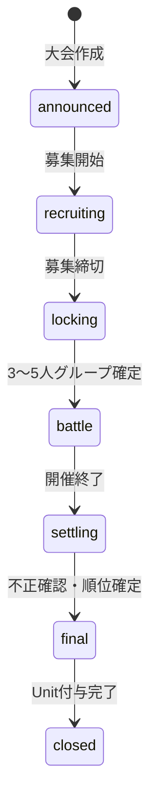

# グループバトル技術設計

> **実装正（技術設計）** — プロダクト確定事項は [`group-battle-design.md`](group-battle-design.md)。  
> 最終更新: 2026-07-31  
> 上位: [`service-overview.md`](service-overview.md)  
> 関連: [`ranking-design.md`](ranking-design.md), [`unit-reward-design.md`](unit-reward-design.md)

---

## 1. 目的と境界

グループバトルは、3〜5 人の確定スクワッド同士が、個人ランキングと同じ総合スコア（`pointsSumV3`）の **平均** で競う期間限定大会である。対象は通常ランキングの **Pick Up 試合**（PRO LEAGUE の全試合スコアは使わない）。

| 対象 | 内容 |
|---|---|
| 含む | 大会マスタ、エントリー/ロック、週×4 + 月×1 集計、ランキング API、Unit 冪等付与、Web/Native UI |
| 含まない | 常設コミュニティ `groups`（最大100人）の改修、Pro 優遇、グループ専用加点 |
| 個人スコア | **再計算しない**。`user_stats_v2_daily` を読む |

常設コミュニティとの関係: **別コレクション・別 API**。流用するのは daily 合算の考え方のみ（`lib/communities/groupStats.ts`）。

---

## 2. 確定方針（第1回）

| 項目 | 値 |
|---|---|
| 同点 | グループスコア同値 → **同順位・同 Unit**（タイブレークなし） |
| Free / Pro | 差なし |
| 最低予想数 | なし（未活動はスコア 0、分母に含める） |
| 1 ユーザー | 1 大会につき 1 スクワッドのみ |
| メンバー数 | ロック時 3〜5。未満は不参加 |

---

## 3. ライフサイクル



### 3.1 大会フェーズ (`GroupBattlePhase`)

| phase | 意味 | 許可操作 |
|---|---|---|
| `announced` | 告知のみ | 読み取り |
| `recruiting` | 募集中 | 作成・参加・申請・脱退・リネーム |
| `locking` | 締切処理中 | 読み取りのみ。バッチが 3〜5 人を `locked`、未満を不参加 |
| `battle` | 開催中 | 読み取り + 暫定ランキング更新 |
| `settling` | 集計・不正確認 | 運営/ジョブのみ mutate |
| `final` | 順位確定 | Unit 付与ジョブ |
| `closed` | 完了 | 読み取りのみ |

### 3.2 スクワッド状態 (`SquadStatus`)

| status | 意味 |
|---|---|
| `forming` | 募集中・人数未達または未エントリー確定 |
| `entered` | 3〜5 人揃い、代表者がルール同意済み |
| `locked` | 大会確定後。メンバー変更不可 |
| `disqualified` | 不正等で除外 |
| `disbanded` | 大会終了後 |

`locking` 完了時点で `entered` かつ 3〜5 人のものだけが `locked` になる。それ以外はランキング対象外。

---

## 4. Firestore モデル

### 4.1 `group_battles/{battleId}`

```ts
{
  name: string;
  phase: GroupBattlePhase;
  /** 募集・開催・確定の JST 境界（ISO または Timestamp） */
  recruitStartAt: Timestamp;
  recruitEndAt: Timestamp;
  battleStartAt: Timestamp;
  battleEndAt: Timestamp;
  /** 週間ラベル一覧（月曜 dateKey）。原則 4。短縮週もここに明示 */
  weeklyLabels: string[]; // e.g. ["2026-11-02", ...]
  /** 月間（大会期間）の集計範囲 */
  monthlyRange: { startKey: string; endKey: string; label: string };
  league: "nba"; // 第1回は NBA
  seasonKey: string; // rankingBySeason 優先バケット
  /** 同点ルール固定（開催後変更禁止） */
  tieRule: "same_rank_same_unit";
  unitRewards: {
    weekly: { maxRank: number; unitsPerMemberByRank: number[] };
    monthly: { maxRank: number; unitsPerMemberByRank: number[] };
  };
  rulesVersion: string;
  createdAt: Timestamp;
  updatedAt: Timestamp;
}
```

### 4.2 `group_battles/{battleId}/squads/{squadId}`

```ts
{
  name: string; // max 20
  ownerUid: string;
  memberUids: string[]; // 順序安定。長さ 1..5（forming）/ 3..5（entered/locked）
  memberCount: number;
  status: SquadStatus;
  inviteCodeHash: string | null;
  inviteCodeLast4?: string;
  rulesAcceptedAt: Timestamp | null;
  rulesAcceptedByUid: string | null;
  createdAt: Timestamp;
  updatedAt: Timestamp;
}
```

### 4.3 `group_battles/{battleId}/squad_members/{uid}`

所属逆引き（1 大会 1 スクワッド制約の正）。

```ts
{
  squadId: string;
  role: "owner" | "member";
  joinedAt: Timestamp;
}
```

### 4.4 `group_battles/{battleId}/join_requests/{requestId}`

```ts
{
  squadId: string;
  applicantUid: string;
  status: "pending" | "approved" | "rejected" | "cancelled";
  createdAt: Timestamp;
  resolvedAt: Timestamp | null;
}
```

同時 pending 申請上限: **3**（ユーザー単位・大会単位）。
所属が決まった時点（申請承認・招待承諾・招待コード参加・作成）で、同一大会の他 pending 申請は **cancelled**。

### 4.4b `group_battles/{battleId}/squad_invites/{inviteId}`

再招集・個別招待（相手の自動加入なし）。

```ts
{
  squadId: string;
  fromUid: string;
  toUid: string;
  status: "pending" | "accepted" | "declined" | "cancelled";
  source: "reform" | "manual";
  sourceBattleId: string | null;
  sourceSquadId: string | null;
  createdAt: Timestamp;
  resolvedAt: Timestamp | null;
}
```

同一大会・同一 `toUid` への作成上限: **2**。

### 4.5 `group_battle_period_snapshots/{snapshotId}`

`snapshotId` = `{battleId}_{period}_{label}`  
例: `gb202611_weekly_2026-11-03`, `gb202611_monthly_battle`

```ts
{
  battleId: string;
  period: "weekly" | "monthly";
  label: string;
  status: "live" | "final";
  range: { startKey: string; endKey: string };
  rows: GroupBattleRankRow[];
  /** 同点グループ数など試験運用用 */
  metrics?: {
    squadCount: number;
    size3: number;
    size4: number;
    size5: number;
    tieGroups: number;
    inactiveMemberRate: number;
  };
  builtAt: Timestamp;
  finalizedAt: Timestamp | null;
}
```

```ts
type GroupBattleRankRow = {
  rank: number; // 同点は同 rank（1,1,3 方式）
  squadId: string;
  name: string;
  groupScore: number; // 平均。小数は実装で丸め（表示は小数1桁想定）
  memberCount: number;
  memberScores: { uid: string; points: number }[];
  prevRank: number | null;
  scoreGapToAbove: number | null; // 直前上位との差
};
```

### 4.6 Unit 台帳 `unit_ledger/{ledgerId}`

個人ランキング付与と共通化する最小台帳。`ledgerId` = 冪等キーそのもの。

```ts
{
  uid: string;
  amount: number; // 正 = 付与
  reason: "group_battle_weekly" | "group_battle_monthly" | ...;
  idempotencyKey: string; // = doc id
  battleId?: string;
  period?: "weekly" | "monthly";
  label?: string;
  rank?: number;
  createdAt: Timestamp;
}
```

冪等キー例:

```
gb:{battleId}:{period}:{label}:rank{rank}:uid{uid}
```

残高: `users/{uid}.unitBalance`（FieldValue.increment）。台帳 doc 作成と残高更新は同一トランザクション。

REWARD UI: `GET /api/group-battles/{battleId}/my-payout`（要認証）。台帳行を優先し、未付与かつ FINAL スナップがある週/月は報酬表から推定（`pending`）。プレビューのみモック。

---

## 5. スコア計算

```
groupScore = sum(member 総合スコア) / lockedMemberCount
```

- メンバー総合スコア = 対象 `startKey`〜`endKey`（両端含む）の `user_stats_v2_daily/{uid}_{dateKey}` から、NBA シーズンバケット優先で `pointsSumV3` を合算
- バケット優先順: `rankingBySeason.{seasonKey}` → `leagues.nba` → `ranking` → `all`（個人期間ランキングと揃える）
- daily が無い日・未活動 = 0。**分母から除外しない**
- グループ専用加点なし

### 5.1 週間

- 原則 月 0:00〜日 23:59 JST（label = 月曜 dateKey）
- `group_battles.weeklyLabels` に列挙された週のみ対象
- 短縮週は labels + 各週の `range` を大会マスタまたはスナップショットに明示

### 5.2 月間

- 暦月ではなく **`monthlyRange`（開催期間全体）**
- 週間成績とは独立集計。Unit は重ねて獲得可

### 5.3 同点

ソートキーは `groupScore` 降順のみ。同値は同じ `rank`。次の順位は飛ばす（competition ranking）。

---

## 6. 集計ジョブ

個人スナップショット cron（JST 16:00 帯）の後段、または同スケジュール内で実行。

1. `phase` が `battle` | `settling` | `final` の大会を列挙
2. 対象 period/label の dateKey 列を決定
3. `status == locked` のスクワッドを列挙
4. 各 `memberUids` の daily を合算 → 平均 → `rows` 生成
5. `status: "live"` で upsert（開催中・猶予中）
6. 期間終了日の **+2 日（JST）** 経過後、自動で `final` へ（運営が `disqualified` を先に反映）
7. `final` かつ未付与なら Unit ジョブを起動

猶予 2 日は個人期間ランキングの遅延精算と揃える。

実装エントリ: `functions/src/groupBattles/buildGroupBattlePeriodSnapshots.ts`

---

## 7. API

ベース: `/api/group-battles`  
認証: Bearer ID トークン（`requireUidFromRequest`）

| Method | Path | 説明 |
|---|---|---|
| GET | `/api/group-battles/current` | 現在（または直近）大会 + 自分の所属 |
| POST | `/api/group-battles/[battleId]/squads` | スクワッド作成（recruiting） |
| PATCH | `/api/group-battles/[battleId]/squads/[squadId]` | リネーム（owner・recruiting） |
| POST | `/api/group-battles/[battleId]/squads/[squadId]/join` | 招待コード参加 |
| POST | `/api/group-battles/[battleId]/squads/[squadId]/leave` | 脱退（owner 以外・recruiting） |
| GET | `/api/group-battles/[battleId]/open-squads` | 空き枠一覧 |
| POST | `/api/group-battles/[battleId]/join-requests` | 申請 |
| POST | `/api/group-battles/[battleId]/join-requests/[id]/approve` | 承認 |
| POST | `/api/group-battles/[battleId]/join-requests/[id]/reject` | 拒否 |
| GET | `/api/group-battles/[battleId]/rankings` | `?period=&label=` |
| GET | `/api/group-battles/[battleId]/my-squad` | sticky 用 |
| GET | `/api/group-battles/me/past-squads` | 直近 3 大会の locked スクワッド履歴（再招集 UI） |
| POST | `/api/group-battles/[battleId]/squads/reform` | 過去スクワッドから下書き作成＋一括招待（owner・recruiting） |
| POST | `/api/group-battles/[battleId]/squads/[squadId]/invite` | 個別招待（過去メンバー含む） |

`locking` 以降のメンバー mutate → **409** (`phase_locked`)。

### 7.1 過去スクワッド再招集（製品 §4.1）

データは新規コレクション必須ではない。既存の `squads` / `squad_members` から導出する。

| 項目 | 方針 |
|---|---|
| 履歴ソース | ユーザーが `squad_members` にいた大会のうち、スクワッド `status === locked`（または大会 `settled`/`closed`） |
| 件数 | 新しい大会から最大 **3** |
| 一括再招集 | `POST .../squads/reform` body: `{ sourceBattleId, sourceSquadId, name? }` → 新スクワッド作成 + 当時 memberUids へ invite/join_request 相当を一括作成 |
| 個別招待 | 既存 join / invite フローに `targetUid` を足すか、専用 invite API |
| 除外 | 退会済み、利用停止、既に当大会の別スクワッド所属 |
| レート | 同一大会・同一 targetUid への再送上限（例: 2） |

UI: 募集中ホームに「過去のスクワッド」セクション。代表者に「同じメンバーで募集」。

---

## 8. UI 整合

正: モバイル Web [`SquadBattlePage`](../app/component/squads/SquadBattlePage.tsx)  
共有型・定数: [`lib/squads/squadBattleMock.ts`](../lib/squads/squadBattleMock.ts) から本番型へ段階移行。本番型は `lib/groupBattles/*`。

| 項目 | 変更 |
|---|---|
| 募集文言 | 約 1〜2 週間前（告知で確定） |
| 再招集 | 過去スクワッド履歴 → 一括 / 個別招待 |
| RANK | WEEK / MONTH サブタブ + LIVE/FINAL |
| 平均 | 確定人数で割る（空き枠除外しない） |
| ロック後 | 参加・脱退・入れ替え UI を無効化 |
| シーズンフェーズ表示 | ENTRY → BATTLE → DISBAND（設計どおり） |

Native は Web 正にパリティ追従。

---

## 9. 試験運用メトリクス（§21）

スナップショット `metrics` および大会クローズ時集計で記録:

- 参加グループ数（locked）
- 3 / 4 / 5 人比率
- 人数別平均グループスコア
- 非活動メンバー率（期間 points == 0）
- 同点グループ数（同一 rank を共有するグループ数）
- Unit 配布総量（台帳 sum）
- 再招集利用率（reform API / 過去履歴からの参加率）

---

## 10. 実装フェーズ

| Phase | 内容 |
|---|---|
| 0 | 本ドキュメント + 製品設計の同点確定 |
| 1 | 大会・スクワッド・エントリー/ロック API |
| 2 | 週/月スナップショット + ランキング API |
| 3 | Web UI 本番接続 |
| 4 | Unit 冪等付与 |
| 5 | Native パリティ |
| 6 | 過去スクワッド履歴 + 再招集（reform / invite） |
| 7 | **運営大会作成 UI**（`/admin/group-battles`）+ Pick Up 専用スコア + RANK 表示名解決 |

### 運営オペ（Phase 7）

1. `/admin/group-battles` で **募集開始・終了 / 対戦開始・終了（JST）** を入力して作成  
2. 週ラベル（月曜 dateKey）・`monthlyRange`・デフォルト Unit 表・`seasonKey` は自動  
3. フェーズボタン: 募集開始 → **締切ロック→BATTLE** → 集計 → 確定 → クローズ  
4. 日次 CF（16:00 JST）がスナップ構築 + Unit 冪等付与

スコア源: `user_stats_v2_daily.rankingBySeason[seasonKey]` のみ（フォールバックはレガシー `ranking`）。`leagues.nba` / `all` は使わない。

---

## 11. 変更履歴

| 日付 | 内容 |
|---|---|
| 2026-07-27 | 初版。データモデル・集計・API・UI・Unit・フェーズを定義 |
| 2026-07-31 | 募集 1〜2 週間。過去スクワッド再招集 API・導出方針・Phase 6 を追加 |
| 2026-08-21 | 運営大会作成（Admin）・スケジュール導出・Pick Up 専用スコア・RANK 表示名 enrich |
| 2026-08-21 | REWARD `GET .../my-payout` — unit_ledger 優先、未付与は FINAL スナップから推定。Web/Native 本番表示 |
| 2026-08-21 | Native ADMIN「スクワッドバトル開催」— 既存 `/api/admin/group-battles` で作成・フェーズ操作 |
| 2026-08-21 | ENTRY enrich: users + cumulative_stats + period_ranking_snapshots（今週/先週/先月）をバッチ取得 |
| 2026-08-21 | 招待コード永続・申請 cancel・リネーム PATCH・脱退/解散・ENTRY 締切実値・フェーズ自動進行・Player フォールバック |
